# Cooperative Particle Swarm Optimization - Integrating Project

This project performs Cooperative Particle Swarm Optimization (CPSO) based on given functions.

Group Members:

Aaron Gabrielle Dichoso

Luis Miguel Antonio Razon

John Kirsten Espiritu

## Project Details

CPSO is an optimization algorithm that searches for optimal values in a given function by distributing agents (called particles) across each swarms, with each swarm assigned to optimize 1 dimension.
Each agent is assigned to search for the optimal value in 1 dimension, collaborating with other agents to find the overall optimal value in the entire space. This algorithm is directly lifted from <a href="https://dl.icdst.org/pdfs/files/8faf7b40f067ab11c14ab935dee8eab0.pdf"> Bergh & Engelbrecht (2004)</a>.

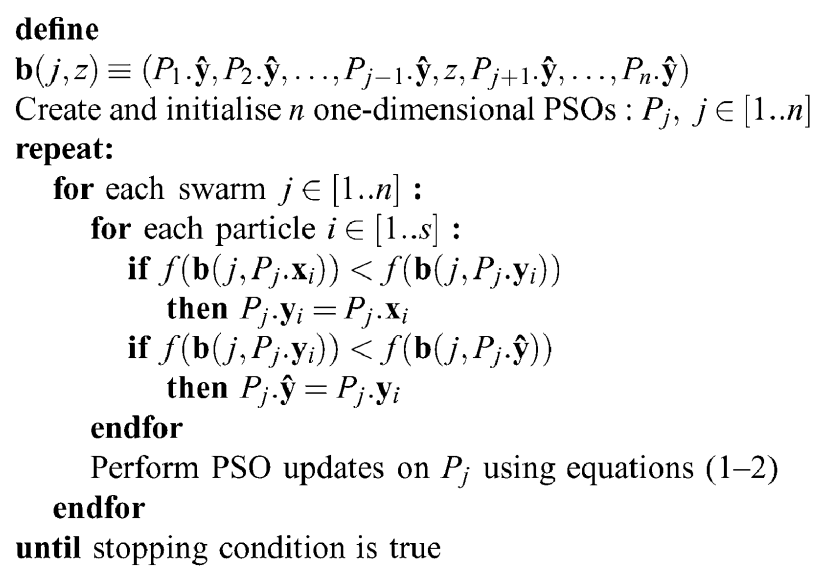

CPSO Algorithm from <a href="https://dl.icdst.org/pdfs/files/8faf7b40f067ab11c14ab935dee8eab0.pdf"> Bergh & Engelbrecht (2004)</a>

This Project includes C and CUDA Kernels to compare the effectiveness of SIMT Parallelism Techniques using CUDA to improve the performance of the Sequential implementation of CPSO.

Through the use of CUDA, the algorithm will be parallelized by dedicating 1 block to every swarm in the function.
Each block will also be assigned 1 thread to every particle assigned to a given dimension.

In other words, every particle is assigned its own thread in the CUDA Kernel Implementation of CPSO.

Additional threads will also be included to handle the synchronization of global bests across each dimension.

The Project was ran on a Cloud Server with a Tesla V100 for the GPU.

# A. Execution Output and Correctness Check

Below are screenshots of the program execution. 
Each kernel was executed 30 times to obtain the average execution time. 
Additionally, each run of CPSO used 100 particles in each dimension and stopped after 500 iterations.

These results can be used in the Results directory.

The C kernel served as the standard of checking the implementation of the CUDA kernels. 
The values in the outputs of the CUDA kernels have to be equal to the results in the C kernel.

The C and CUDA Kernels were tested using 3 formulas with known global minimums:
1. The Sphere Function
2. The Ackley Function
3. The Rosenbrock Function

Additionally, the C and CUDA kernels tested variants of each formula containing 4, 256, 1024, and 8192 dimensions.
Due to time constraints, however, the C kernels were not tested with 8192 dimensions.

## C Kernel Executions
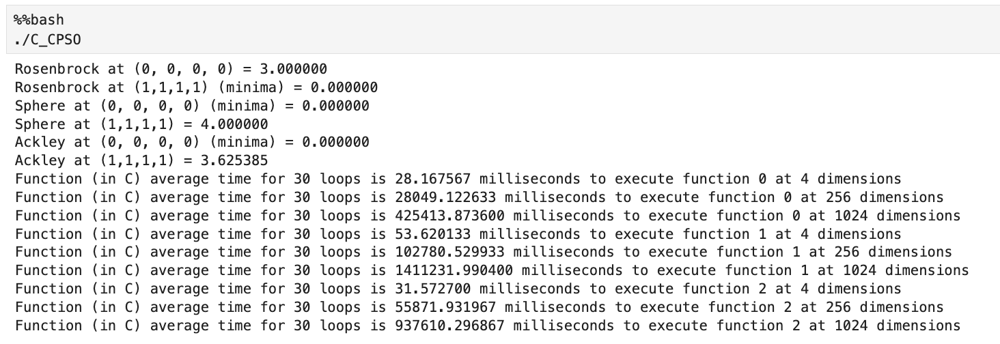

## CUDA Kernel Executions
### N = 4 (2^2)
#### Sphere
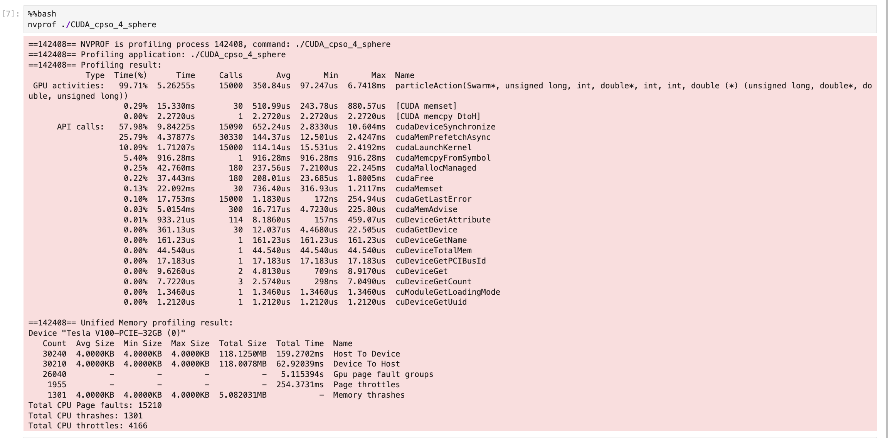
#### Ackley
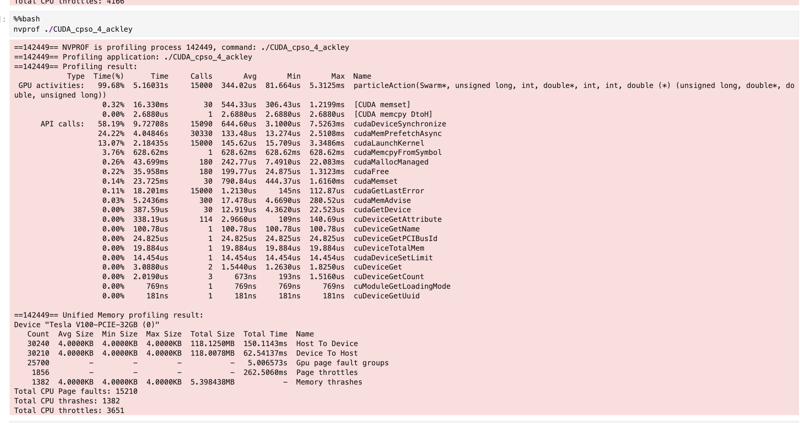
#### Rosenbrock
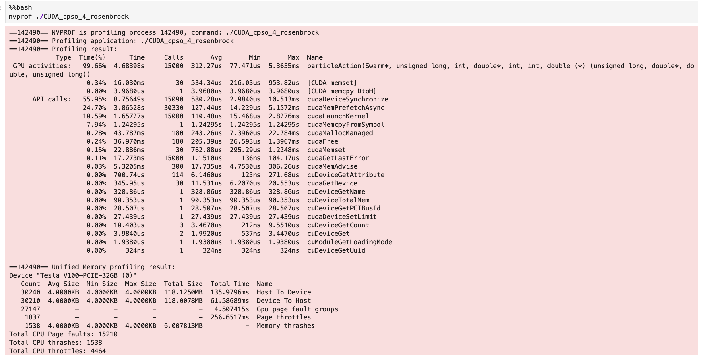

### N = 256 (2^8)
#### Sphere
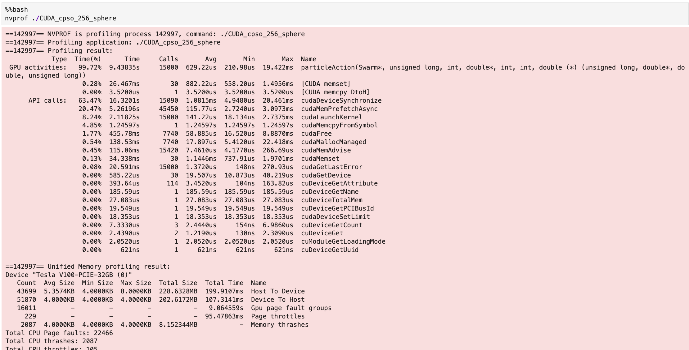
#### Ackley

#### Rosenbrock
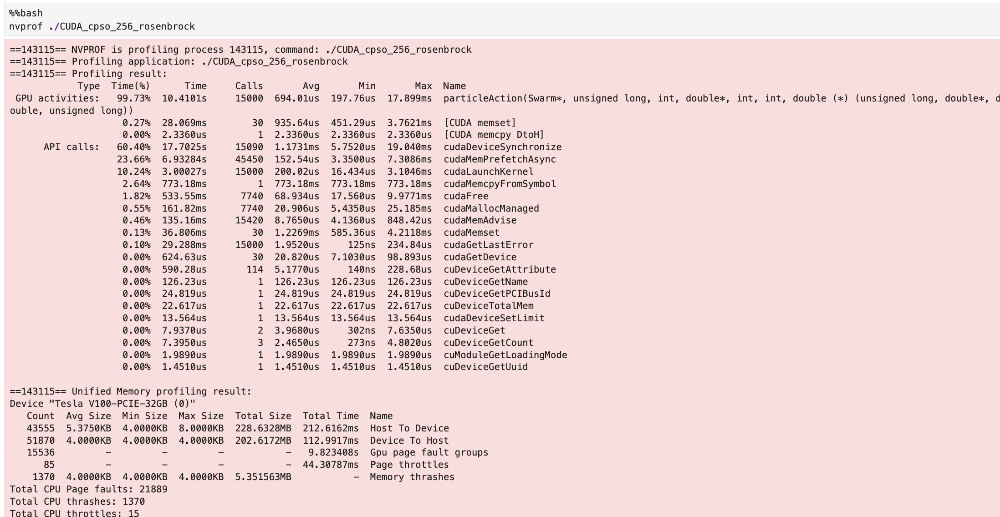

### N = 1024 (2^10)
#### Sphere
.png)
#### Ackley
.png)
#### Rosenbrock
.png)

### N = 8192 (2^13)
#### Sphere
.png)
#### Ackley
.png)
#### Rosenbrock
.png)

# B. Execution Times
## Summary of Results 
### Average Execution Times
The table below shows the average execution time of each kernel according to dimension size and function:
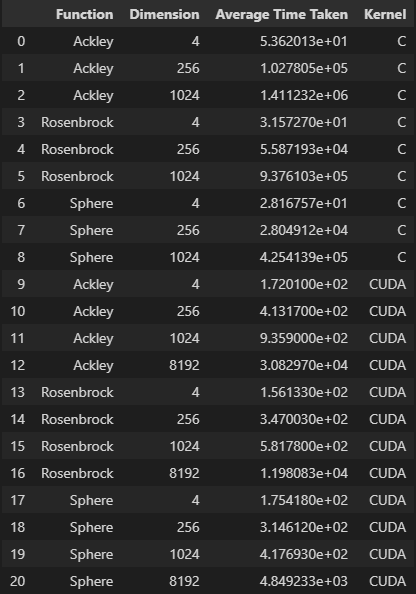

Here is the same data, visualized using a bar graph:
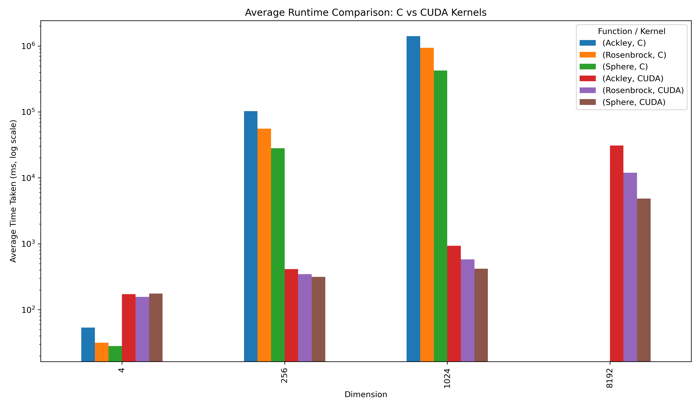

### Function Speedup
The Speedup of utilizing ASM kernel functions compared to the performance of the C kernel was also obtained by dividing the average execution time of the C kernel with the average execution time of the ASM kernel functions.
This resulted in the following results:
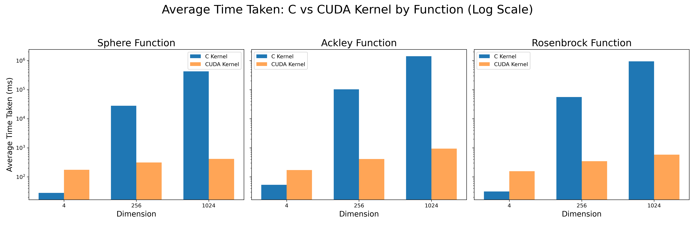

Interestingly, the C Kernel performed faster than the CUDA Kernel in 4 dimensions, indicated by the lower speedup found in this table:
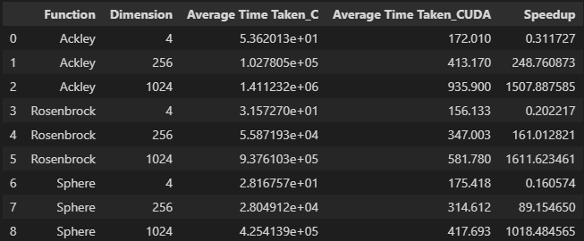

We think that the C Kernel performed better than the CUDA Kernel in the lowest number of dimensions was because of (REASON HERE).

The CUDA Kernel consistently performed immensely better in dimension configurations higher than 4. This is expected because of the time complexity of CPSO. (EXPAND MORE ON HERE)

# E. Reflection

- GPU and CPU architecture differences found very well in this project - Miles of speedup compared to sequential with the cost of needing additional hardware
- GPU works better in simpler functions (See Differences in Execution Time between functions)
- Interesting to see the evolution of our computer science studies all culminating into this project:
- Time Complexity Analyses Techniques of Data Structures and Algorithms Class
- Parallelism Techniques in Advanced Databases, Operating Systems, and Distributed Computing Classes
- Finally the use of SIMT Techniques in Advanced Computer Architecture in this class
- We find it very interesting how all of these classes helped us learn to how best utilize computer architecture according to the use case.

